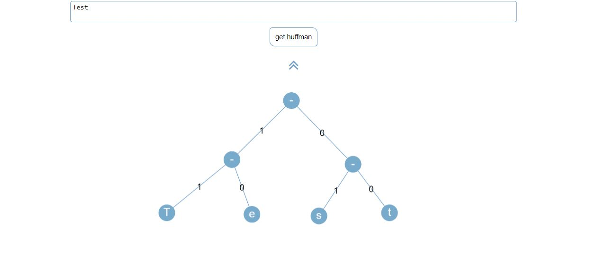

# Huffman-Code-Visulizer
A simple visualization for huffman tree, which is used in encoding text.
 link to live web app so you can try it out : https://huffmanvisualizer.netlify.com/
- You can read about the theory behind Huffman-Coding algorithm: https://en.wikipedia.org/wiki/Huffman_coding

